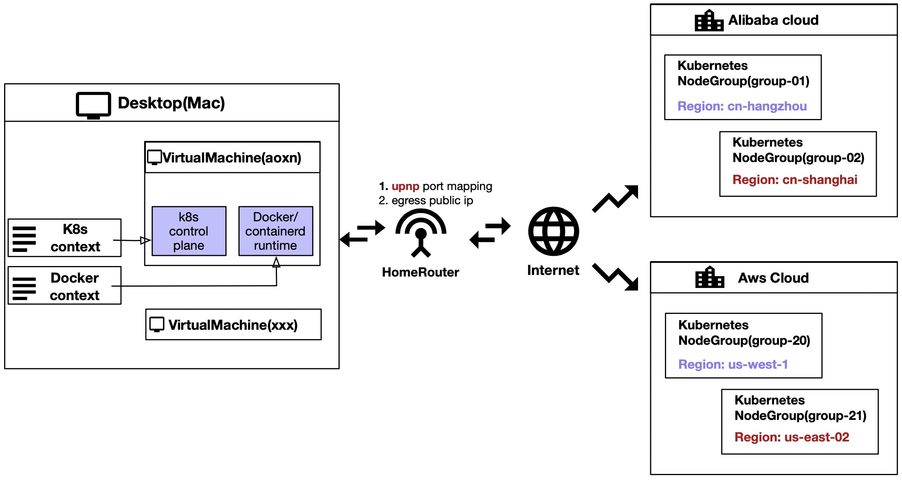

## Meridian 口袋容器，让容器化变得更简单！
在当今快速发展的云原生时代，容器技术已成为开发者和运维团队不可或缺的工具。无论是开发、测试还是生产环境，容器化应用都以其高效、灵活和可移植性赢得了广泛青睐。然而，随着容器生态的日益复杂，如何高效管理容器环境成为了许多团队面临的挑战。
一方面用户需要一个完整的开箱即用的docker和原生kubernetes环境，无论是用于容器化的应用开发测试，还是大模型研究。
另一方面受限于本地设备的有限处理能力，如果能同时借用云上的算力，将极大的提升本地设备的算力边界。
## Meridian口袋容器是什么
Meridian口袋容器正是在这个环境下逐步孵化的。类似于Docker/Rancher Desktop，口袋容器提供了桌面环境下开箱即用的Docker和原生kubernetes以及Virtual Machine支持，满足开发者日常绝大多数场景下的开发测试需求。不仅如此，针对居家办公场景，口袋容器还提供了多云支持，利用云的弹性，将云上节点与本地Desktop组成完整的k8s集群，在本地畅游云端。
口袋容器更注重轻量化和易用性便携性，特别适合个人开发者、小型团队以及对资源敏感的用户群体。


## 快速体验Meridian口袋容器（当前仅支持Mac OS）
[参考文档](https://aoxn.github.io/meridian-docs/get-started/getting-started/)

1. 快速安装`curl get.xdpin.cn/meridian/iou.sh|bash -x`。
2. （optional）设置命令别名`alias m=meridian`
3. 创建容器运行时环境。由于VM的镜像比较大，受限于家庭网络的带宽，可以先手动pull镜像缓存[optional]。
``` shell
➜  meridian git:(master) ✗ m get image -d
   NAME                 OS                            Arch           
   ubuntu24.04.x86_64   linux                         x86_64         
   ubuntu24.04.arm64    linux                         aarch64
➜  meridian git:(master) ✗ m pull ubuntu24.04.x86_64

# 创建名为abc的虚拟机，默认会同时初始化docker和kubernetes环境。
➜  meridian git:(master) ✗ m create vm abc
# 查询创建的VM的状态，以及IP地址。Docker context 地址。等等
➜  meridian git:(master) ✗  m get vm 
NAME   ADDRESS              STATE     DOCKER_ENDPOINT
aoxn   192.168.64.14        Running   [docker context use aoxn]
```

4. 使用容器环境(通过docker/kubernetes编译/构建/打包/部署 容器化的应用)
``` shell
➜  meridian git:(master) ✗ docker context use abc
abc
Current context is now "abc"

➜  meridian git:(master) ✗ docker ps
CONTAINER ID   IMAGE   COMMAND  CREATED  STATUS   PORTS     NAMES

➜  meridian git:(master) ✗ kubectl config get-contexts
CURRENT   NAME                                       CLUSTER                 AUTHINFO             NAMESPACE
*         meridian.user.aoxn@meridian.cluster.abc   meridian.cluster.abc   meridian.user.abc

# 通过ssh可以直接登录vm。
➜  meridian git:(master) ✗ ssh abc@192.168.64.14 
```

5. 快速销毁容器环境（包括虚拟机）。【针对开发测试环境容易污染的问题，口袋容器能高效重建环境并恢复配置】
``` shell
# 删除vm及其容器环境
➜  meridian git:(master) ✗ m delete vm abc
```

6. 为本地k8s添加云上节点。（试验功能，测试中，仅用于一般家庭网络中，需要本地路由器开启upnp协议，公司网络不适用）。 请[参考文档](https://aoxn.github.io/meridian-docs/get-started/getting-started/)
## 欢迎加入与反馈
Meridian致力于为用户提供一个轻量便携的容器环境。希望更多人一起参与完善，在参与的过程中解决您的问题。欢迎在[Github](https://github.com/aoxn/meridian)上提交Bug和Feature Request。也可以加入到钉钉群我们一起讨论解决方案。

<center>
{width=250px}
</center>


